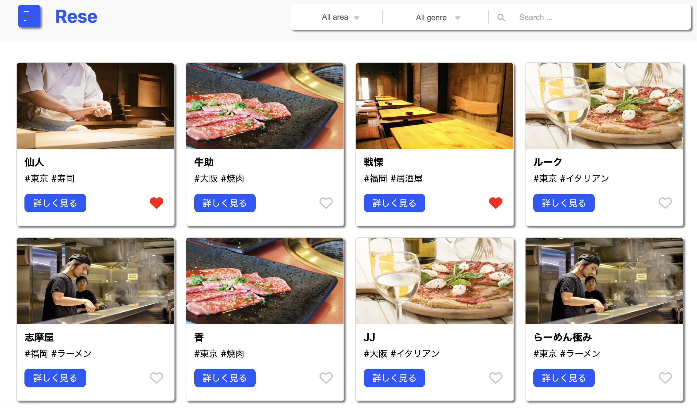
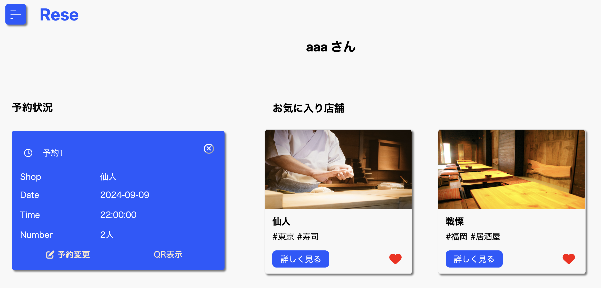
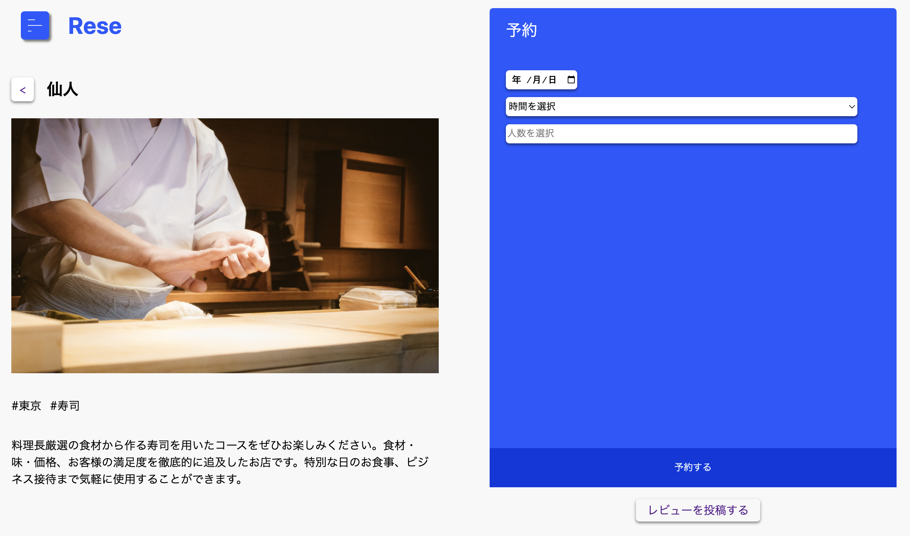
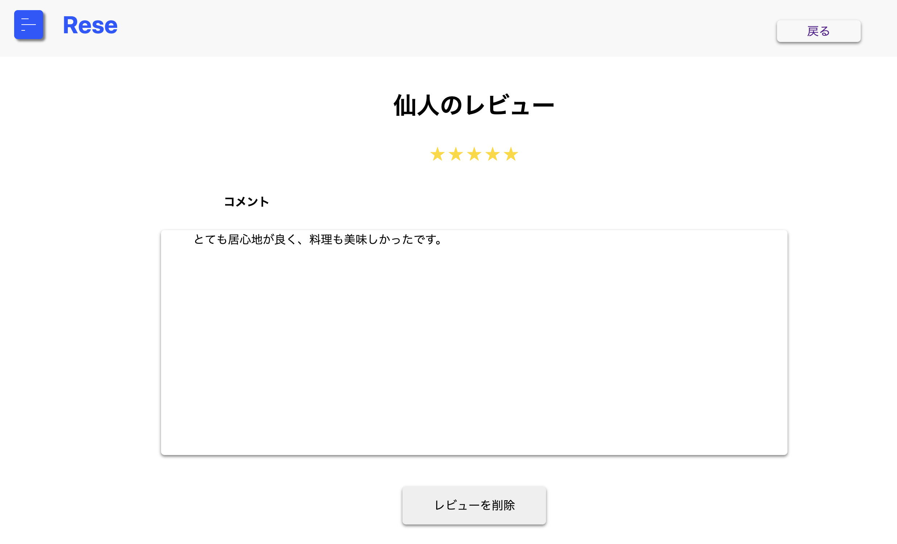
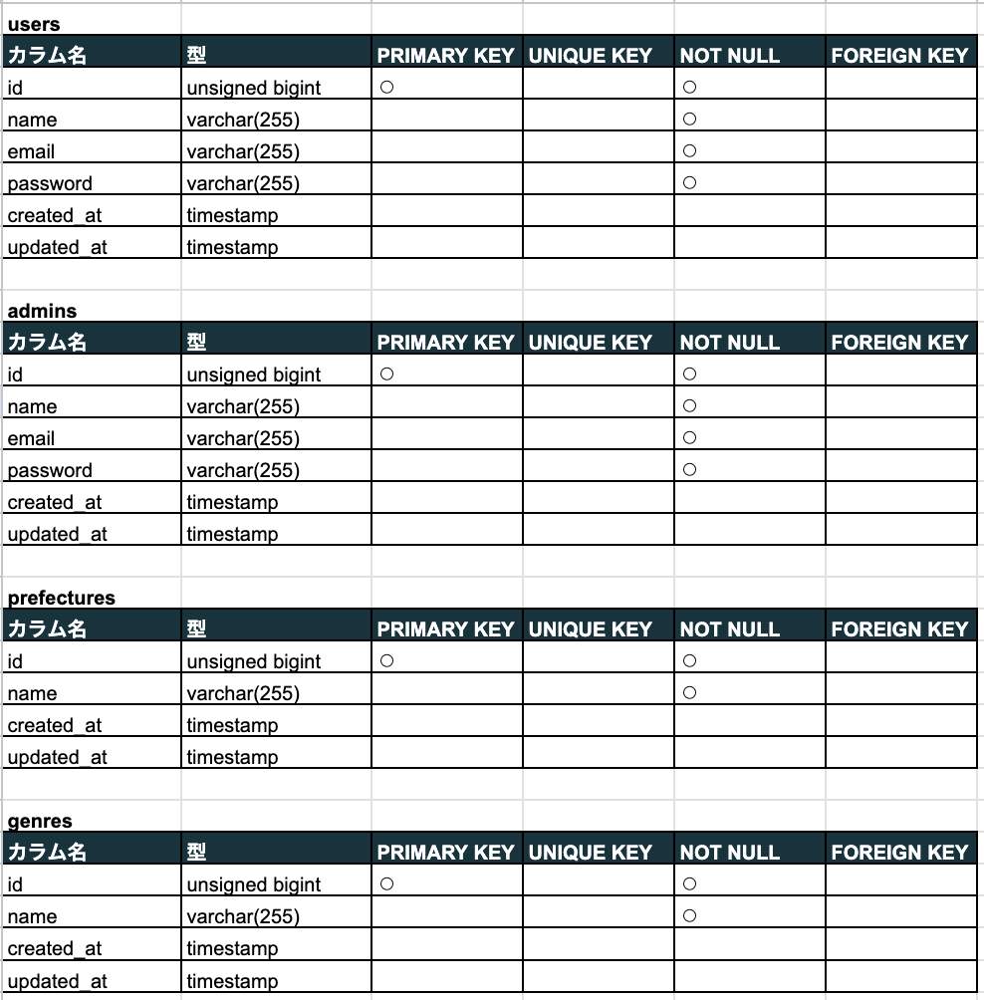
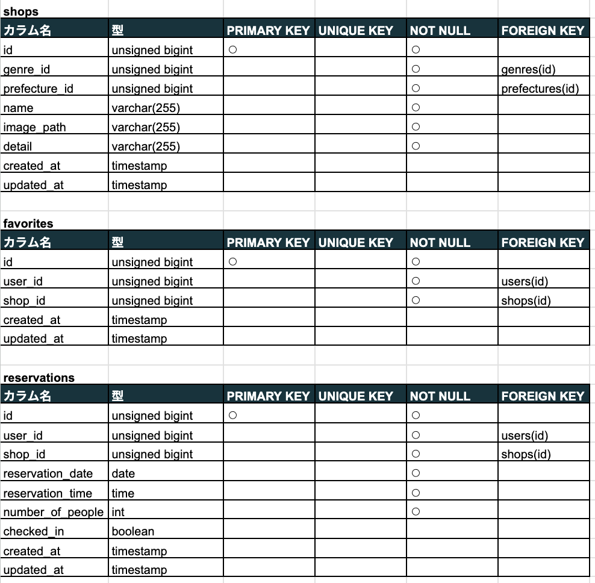
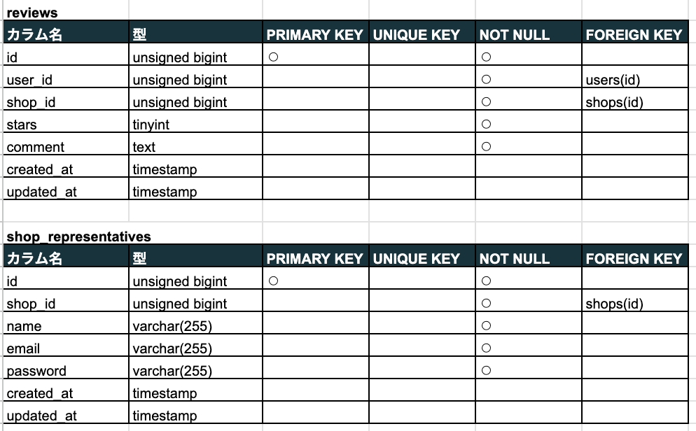
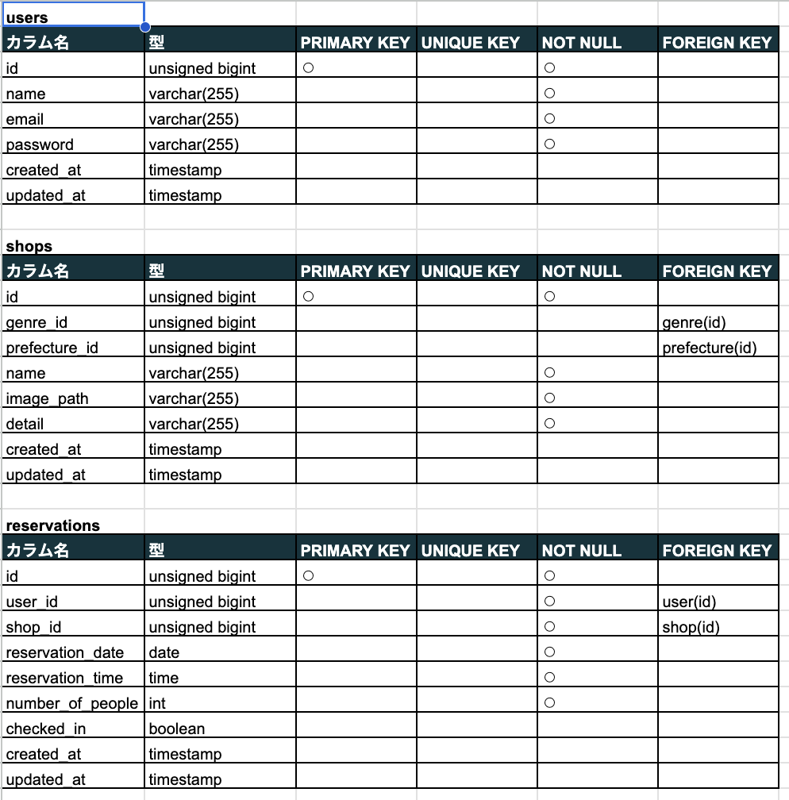

# Reserve
飲食店予約サービスを自社で制作し、管理まで自社で行える

機能を実装したアプリケーション

## 作成した目的
自社独自の飲食店予約サービスを管理し、予約状況の把握や集計をスムーズにするため

初年度でのユーザー数10000人を目標とする

## アプリケーションのURL
https://github.com/teestojko/Reserve.git

## 他のリポジトリ
なし

## 機能一覧

fortifyログイン機能

メール認証機能

飲食店予約、予約変更機能

お気に入り機能

エリア、ジャンル、店舗名で検索機能

レビュー機能

QRコード照合機能

stripe決済機能

予約情報のリマインダーメール送信機能
（awsの本番環境で実行するとメール送信されます）

#### 管理者用ページ

ユーザーにメール送信機能

店舗代表者作成機能

#### 店舗代表者ページ

店舗情報の作成、更新機能

予約情報の確認機能

## 使用技術（実行環境）
laravel 8.83.27

php 8.3.8

JavaScript

html 5

css 3

## テーブル設計

## ER図

# 環境構築

git clone git@github.com:teestojko/template.git

### 名前変更

mv template Reserve(お好きな名前に変更)

### プロジェクトのルートディレクトリ(Reserve)に移動して、

git remote set-url origin https://github.com/teestojko/Reserve.git

(作成されたgitのURLを、下記のoriginの後ろに記述)

### dockerイメージ作成　起動　&　phpバージョン変更

docker-compose up -d --build

composer.jsonのphpの記述を
"php": "^7.3|^8.0|^8.3",
に変更

composer config --global platform.php 8.3.8

composer update

composer install

php artisan key:generate

### .envの作成、記述変更

cp .env.example .env

### .env

DB_HOST=mysql

DB_PORT=3306

DB_DATABASE=laravel_db

DB_USERNAME=laravel_user

DB_PASSWORD=laravel_pass

##### (適宜挿入したいダミーデータを記述)

php artisan migrate

php artisan db:seed