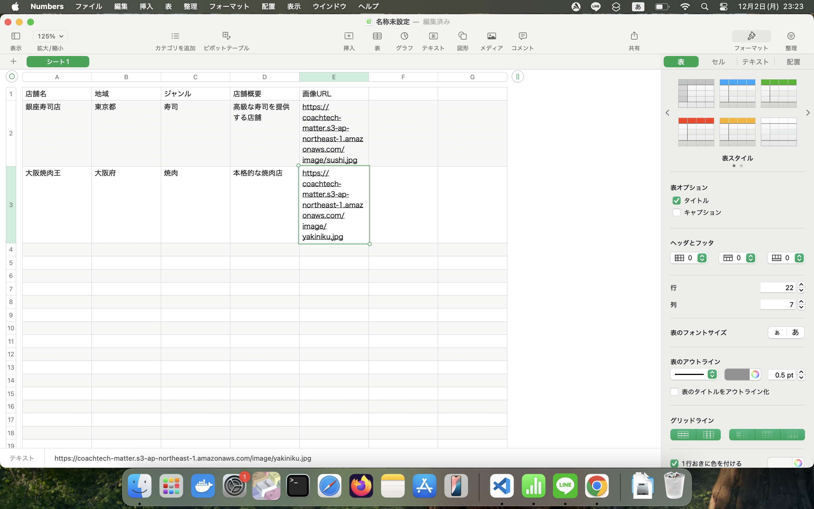
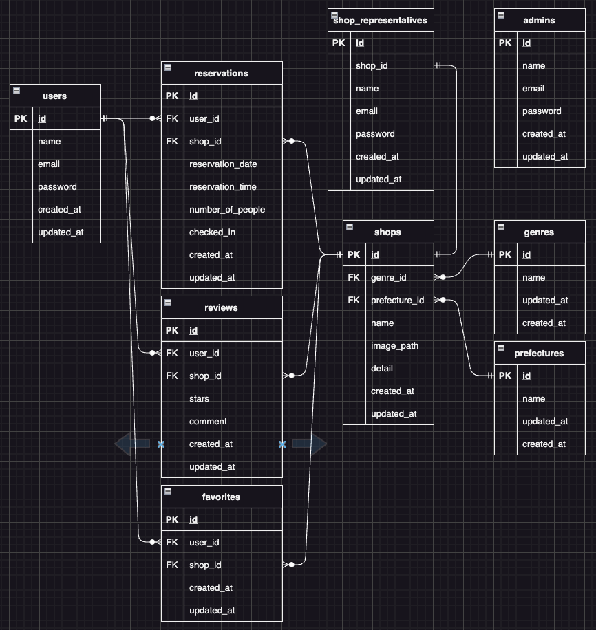
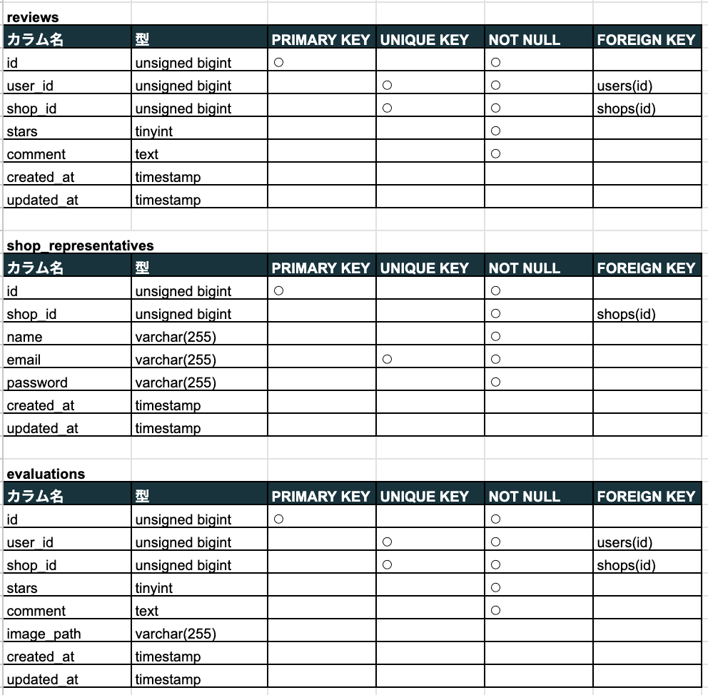
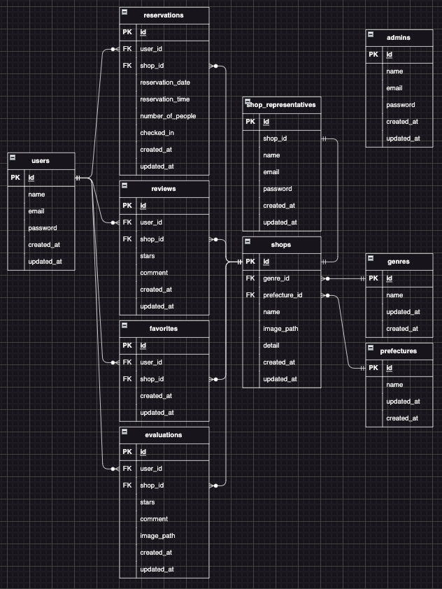

# Reserve
飲食店予約サービスを自社で制作し、管理まで自社で行える

機能を実装したアプリケーション

## 作成した目的
自社独自の飲食店予約サービスを管理し、予約状況の把握や集計をスムーズにするため

初年度でのユーザー数10000人を目標とする

## アプリケーションのURL
https://github.com/teestojko/Reserve.git

## 他のリポジトリ
なし

## 機能一覧

fortifyログイン機能

メール認証機能

飲食店予約、予約変更機能

お気に入り機能

エリア、ジャンル、店舗名で検索機能

レビュー機能

QRコード照合機能
(awsの本番環境のQRコードで読み取りできます)

stripe決済機能

予約情報のリマインダーメール送信機能
（awsの本番環境で実行するとメール送信されます）

#### 管理者用ページ

ユーザーにメール送信機能

店舗代表者作成機能

#### 店舗代表者ページ

店舗情報の作成、更新機能
(作成された店舗情報の画像はストレージに保存されます)

予約情報の確認機能

#### 追加機能

店舗一覧ソート機能
(ランダム、口コミ評価の高い順、低い順)

口コミ機能
(管理者の口コミ削除機能は管理者用ページから削除できます)

csvインポート機能

(csvインポートは管理者用ページから実行できます)

(下記の図のように記述するとインポート出来ます)

## 使用技術（実行環境）
laravel 8.83.27

php 8.3.8

JavaScript

React

html 5

css 3

## テーブル設計

## ER図

# 環境構築

git clone git@github.com:teestojko/Reserve.git

### dockerイメージ作成 起動

docker-compose up -d --build

### homebrewをインストール

/bin/bash -c "$(curl -fsSL https://raw.githubusercontent.com/Homebrew/install/HEAD/install.sh)"

### php gdをインストール

brew install php

brew install gd

### gdが有効になっているか確認

php -m | grep gd

### 有効になっていれば gd と表示される

composer update

composer install

### .envの作成

cp .env.example .env

### (環境に合わせてパスワード等を設定してください)

### アプリケーションキーを作成

php artisan key:generate

### シンボリックリンクを作成

php artisan storage:link

### マイグレーション＆シーディング

php artisan migrate

php artisan db:seed